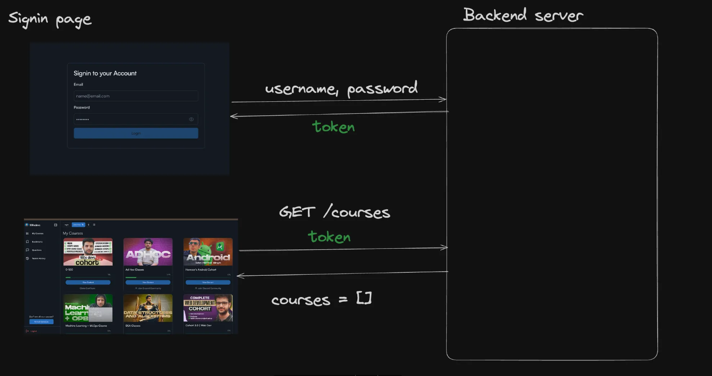
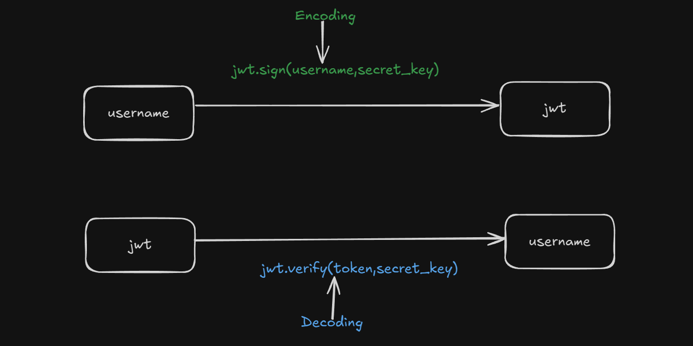

# 🔐 In-Memory Token-Based Authentication

## 📁 Authentication-01

- Implementation of in-memory token-based authentication
- [View File](Authentication/authentication1.js)

---

## 🔑 Authentication with JWT

## 📁 Authentication-02

- In-memory authentication using **JWT (JSON Web Token)**
- [View File](Authentication/authentication2.js)

---

## 🧭 Authentication Workflow

---

## 🧬 JWT Encoding & Decoding

---

## 🌐 Explore JWT

- [jwt.io - Official Website](https://jwt.io/)
